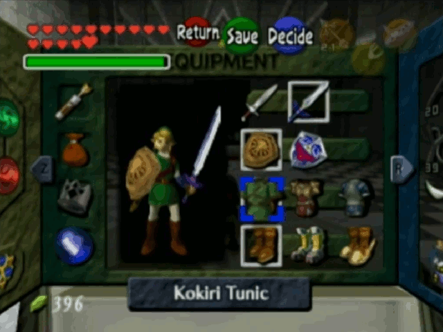

# z64playerRenderInit
This OoT/MM mod allows functions to be embedded into and run from within player model files once per frame, enabling us to do fun effects like flowing capes, glowing materials, physics, scrolling textures, alternate costume/tunic models, HUD elements, and more.

## Showcase
[](https://www.youtube.com/watch?v=HG5e8ky8Q6Y)

## Prerequisites
 * [`z64playas`](http://www.z64.me/tools/z64playas)
 * [`z64convert`](http://www.z64.me/tools/z64convert)
 * `z64ovl` or `Sharp Ocarina`
 * your `z64playas` manifest must use the `POOL` feature

## Building (`z64ovl`)
 * change the `#include`s to be for your specific version or game
 * run `make clean && make`
 * `func.ovl` and `mod.bin` are generated

## Building (`Custom Actor Toolkit`)
 * this is how most people will use this
 * adjust the `#include` in your source to be for the game and version you're targeting
 * use `Custom Actor Toolkit` to build `func.c` (it's super straightforward)
 * `func.ovl` will be generated, which you then use in `z64playas`

## Warning
 * the assembly at the start of `func.c` is a hacky way of trying to guarantee a jump to the `renderinit` function will be at the beginning of the overlay's `.text` section
 * it is very important that the beginning of the overlay's `.text` section be `renderinit`, or a jump to `renderinit`
 * it is important that `main.c` (the mod) compiles in such a way that the function `main_wowProc` has the address `0x80800000`

## OoT debug ([`bin/oot/debug`](bin/oot/debug))
 * write `code_0xb8828.bin` at `0xB4C828` (that is at `0xB8828` in `code`)
 * write `0C0355A2` at `0xB09264` (that is at `0x75264` in `code`)
 * write `0C0355A2` at `0xC1903C` (that is at `0x17F8C` in `ovl_player_actor`)
 * write `00000000` at `0xFE17FC` (if using vanilla `Adult Link`) (that is at `0x57FC` in his `zobj`)
 * write `00000000` at `0x10197FC` (if using vanilla `Young Link`) (that is at `0x57FC` in his `zobj`)

## OoT NTSC 1.0 ([`bin/oot/ntsc10`](bin/oot/ntsc10))
 * write `code_0x9dac4.bin` at `0xB24AC4` (that is at `0x9DAC4` in `code`)
 * write `0C02BAD9` at `0xAF2940` (that is at `0x6B940` in `code`)
 * write `0C02BAD9` at `0xBE5C4C` (that is at `0x180DC` in `ovl_player_actor`)
 * write `00000000` at `0xF8B7FC` (if using vanilla `Adult Link`) (that is at `0x57FC` in his `zobj`)
 * write `00000000` at `0xFC37FC` (if using vanilla `Young Link`) (that is at `0x57FC` in his `zobj`)

## Using `func.ovl` once you've built or downloaded one
 * `func.ovl` goes in the `Dynamic ZOVL` field in `z64playas`
 * make sure you have patched your game to be compatible with this tweak first
 * wow how easy

## How does it work? (a technical explanation)
This mod assumes a structure of this type resides at `0x57F8` in Link's 3D model file:
```c
struct z64playerRenderInit
{
   /* offsets are relative to the start of Link's model in ram */
   uint32_t     start;           /* offset of start of overlay    */
   union
   {
      uint32_t  header;          /* offset of overlay header      */
      void      (*exec)(void*);  /* main routine after relocating */
   } u;
} *rinit;
```
Immediately before Link's drawing routine, the mod checks `rinit->u.header`. If its value is `0`, no overlay is present. If it's a ram address, the function at that address is executed. Otherwise, the overlay described by `rinit` is relocated (a process which converts virtual ram addresses to physical ram addresses), and `rinit->u.exec` is updated to point to the main routine in the overlay.

In other words, this mod executes code stored in Link's 3D model file, of all places.

## Why do it this way?
My approach is meant to maximize accessibility, portability, and ease of use: apply a very small patch to the game and you're ready to write code for your play-as mod. You don't have to worry about setting up your own hook, or injecting code, or hardware/Wii-VC compatibility, or porting (just change build targets). All the hard work is already done for you so you can focus on the fun part: being creative.

An additional benefit from using this implementation is that your play-as mods are automatically compatible with Ocarina of Time Online.

## Special thanks
E-Gor, CrookedPoe: N64 hardware testing

Mikau6: Wii VC testing
